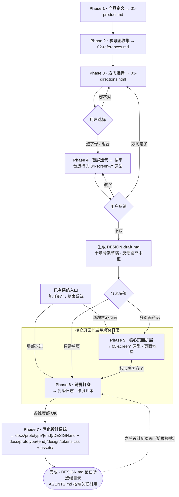

# zero-to-design

[English](README.md) · **简体中文**

一个交互式 agent skill，既支持从零建立设计系统，也支持接入已有系统后增量设计页面和组件。已有系统可以直接复用现有设计资产；如果没有设计文档，skill 会先探索系统并提取一套可追踪的设计基线，再进入核心页面扩展或针对性的跨屏打磨。

👉 **在线示例：** [Pulse（含可交互产物）](https://mitaraifail.github.io/zero-to-design/)

## 快速识别与启动

需要与用户逐步确定界面方向，并把预览和设计决策沉淀为 `DESIGN.md` 时，使用 `zero-to-design`。可以在支持 skill 选择器的客户端直接选择它，也可以在请求中写明 `zero-to-design`：

| 场景 | 可以这样说 | 入口 |
|------|------------|------|
| 新产品从零设计 | “用 zero-to-design 在 admin 端设计 Web 首页，建立 DESIGN.md” | 从产品定义开始 |
| 已有系统新增页面或组件 | “用 zero-to-design 在 admin 端设计订单详情页，沿用现有组件” | 先核对现有设计资产，再扩展页面 |
| 审查现有 UI 或提取设计系统 | “用 zero-to-design 检查当前界面，并提取 DESIGN.md” | 先建立或核对设计基线 |
| 继续上次设计 | “继续 zero-to-design 的 admin 端首屏设计” | 从 `docs/prototype/{end}/design/state.md` 恢复 |

每次先选定产品端目录名，如 `admin` 或 `user-app`；未指定时 skill 会询问。`{end}` 表示该名称，只接受小写字母、数字和中间的连字符；中文别名记录在该端的状态文件。Web/H5 是端目录内的平台子目录。目标项目不是当前目录时，请在请求中给出项目路径；需要 Web、H5 或双平台时也请说明。收集参考时，你可以主动提供竞品名称、链接、截图或具体页面，并指出想借鉴或避免的地方。完整流程见 [SKILL.md](SKILL.md)。



## 它能做什么

`zero-to-design` 是一个为 AI coding agent 设计的对话式设计工作流，专为后端工程师和非设计师打造。它支持两类任务：从零建立设计系统，或接入已有系统后继续设计多屏页面和组件。已有系统入口会优先寻找并验证现有 `DESIGN.md`、Token、组件和工程约束；如果这些资产不存在，则通过代码与运行中的页面探索生成“观察得到的设计基线”。新增核心页面进入 Phase 5，局部改进则可以直接进入 Phase 6。

| Phase | 名称 | 产出 |
|-------|------|------|
| 1 | 产品定义 | `01-product.md` — 8 个关键问题锁定"做什么、做成什么感觉" |
| 2 | 灵感收集 | `02-references.md` — 用户与代理推荐的参考、截图标注、喜欢/不喜欢、显式偏好 |
| 3 | 方向选择 | `03-directions.html` — 3-4 个真正不同的设计方向，每个含配色、字体、布局和可交互的签名动作 |
| 4 | 首屏迭代 | 各目标平台的 `04-<screen>-v*` 可运行原型 + `DESIGN.draft.md` — 迭代 1–2 个关键首屏直到你说"不错" |
| 5 | 核心页面扩展 | 各目标平台的 `05-<screen>-v*` 可运行原型 + `05-screen-map.md` + `component-inventory.md` — 最小核心页面集、UI 状态与实现契约 |
| 6 | 跨屏打磨 | `06-polish-log.md` + 可选维度评审页 — 字体、间距、色彩、组件、响应式、无障碍与动效 |
| 7 | 设计系统固化 | `docs/prototype/{end}/DESIGN.md` + `docs/prototype/{end}/design/tokens.css` + `docs/prototype/{end}/design/assets/` — 最终可复用的设计系统，并在 AGENTS.md 中关联引用 |

阶段草稿、预览、状态和其他过程产物保存在项目根目录下的 `docs/prototype/{end}/design/`。

阶段 3 仍用轻量 HTML 比较方向。阶段 4 起，新项目默认 Vue 3 + TypeScript + Vite；Web 使用 Ant Design Vue，H5 使用 Vant 4。已有项目沿用自己的框架、构建工具和组件库。只制作用户要求的平台；双平台任务在 `docs/prototype/{end}/design/web/` 和 `docs/prototype/{end}/design/h5/` 分别提供独立预览入口。原型使用示例数据与本地交互，不接入真实 API 或业务状态管理；实际技术选择、组件使用和语义 Token 映射记录在 `docs/prototype/{end}/DESIGN.md`。

## 为什么写这个 skill

我最近要从零搭一个新网站。最难的部分不是代码——而是让 AI 生成的界面既好看，又能保持一致。

这段经历沉淀出一条三步路径，最终长成了 `zero-to-design`。

**第一步："AI 味"只是缺少方向的产物。**
让模型"做一个现代感的落地页"而不给任何具体要求时，它返回的是训练数据的统计平均值：紫色渐变、Inter 字体、三列功能卡、fade-up 动画。现有的"去 AI 味"技能可能矫枉过正，把你真正喜欢的东西也一并抹掉。真正的解法是同时给模型正向的设计指导和明确的红线规则。

**第二步：这些规则的容器是 `DESIGN.md`。**
没有单一事实来源时，agent 写的每个页面都会漂移：不同的按钮、不同的间距、不同的交互模式。`DESIGN.md` 正在成为 AI 可读设计系统的事实标准——颜色、字体、组件、UX 约束、Do/Don't 规则全部写在一个文件里，再从 `AGENTS.md` 引用。

**第三步：难的是从零建立第一份有审美的 `DESIGN.md`。**
知道规范该放在哪儿很容易，知道该往里写什么才难——尤其当你不是设计师的时候。`zero-to-design` 就是带你走过这段鸿沟的引导式对话：产品定义、参考收集、方向选择、首屏迭代、核心页面扩展、跨屏打磨、最终固化。

简言之：**去 AI 味只是起点，DESIGN.md 是容器，而 `zero-to-design` 解决的是从零建立这个容器的最后一公里。**

## 特点

- **对话式引导**——每一步都解释"为什么"，并给出具体可选项；自由输入的回答永远被接受，不会被强行映射回预设选项
- **内置设计能力**——方向、排版、布局、动效、适配和审查规则随 skill 分发；按阶段读取，无需安装其他设计 skill
- **已有系统接入**——支持复用已有设计资产，也支持从代码和运行页面探索出设计基线；新增核心页面进入 Phase 5，局部改进进入 Phase 6
- **多候选探索**——Phase 5 可比较核心页面结构，Phase 6 可在既有 `DESIGN.md` 约束内比较各维度的打磨方案
- **活的 DESIGN.md**——从 Phase 4 起设计决策就累积进 `DESIGN.draft.md`，随你的反馈持续演进，Phase 7 固化；完成后还有扩展模式，可以基于已有设计系统继续设计新页面
- **自动语言匹配**——skill 会识别你的语言，并用它运行整个体验（对话、提问、以及每一个生成的产出物）；只有文件名、token 名和代码标识符保持英文

## 安装

### 通过 skills CLI（推荐）

```bash
npx skills add manzusaka/dev-flow-skills
```

> 也可以加 `-g` 安装到全局，对所有项目生效。

### 更新

更新已经安装的 skill 时，在原来的项目目录中重新运行同一条命令：

```bash
npx skills add manzusaka/dev-flow-skills
```

如果当初是全局安装，请保留 `-g`：

```bash
npx skills add manzusaka/dev-flow-skills -g
```

更新后请重启 Agent 会话，让它重新加载最新的 `SKILL.md`。如果本地修改过 skill，重新安装可能覆盖这些修改，请先备份。

### 手动安装

克隆仓库并拷贝到你的 agent 的 skills 目录：

```bash
git clone https://github.com/manzusaka/dev-flow-skills.git

# Claude Code
cp -r dev-flow-skills/skills/design/zero-to-design ~/.claude/skills/

# Kimi Code CLI
cp -r dev-flow-skills/skills/design/zero-to-design ~/.agents/skills/
```

### 卸载

```bash
npx skills remove zero-to-design
```

如果是全局安装，加 `-g`：

```bash
npx skills remove -g zero-to-design
```

## 内置设计能力与检查

阶段 3–7 按需读取 `references/` 中的 12 项设计能力；iOS/Android 使用相应的 `references/native/` 指引。`scripts/doctor.mjs` 检查 `docs/prototype/{end}/design/state.md` 与阶段产物；`scripts/scan.mjs` 对 Web 源码提供有限的字体、布局和实现线索，结果仍需结合渲染核对。两个脚本只依赖 Node.js 内置模块。用户明确指定其他 skill 时可以额外使用。

```bash
node <zero-to-design目录>/scripts/doctor.mjs --target <项目目录> --folder <端目录名> --json
node <zero-to-design目录>/scripts/scan.mjs --target <Web源码路径> --scope type,layout,audit --json
```

## License

[MIT](LICENSE)；改编的内部能力文件保留 [Impeccable Apache-2.0 许可](licenses/IMPECCABLE-APACHE-2.0.txt) 与 [来源说明](THIRD_PARTY_NOTICES.md)。
